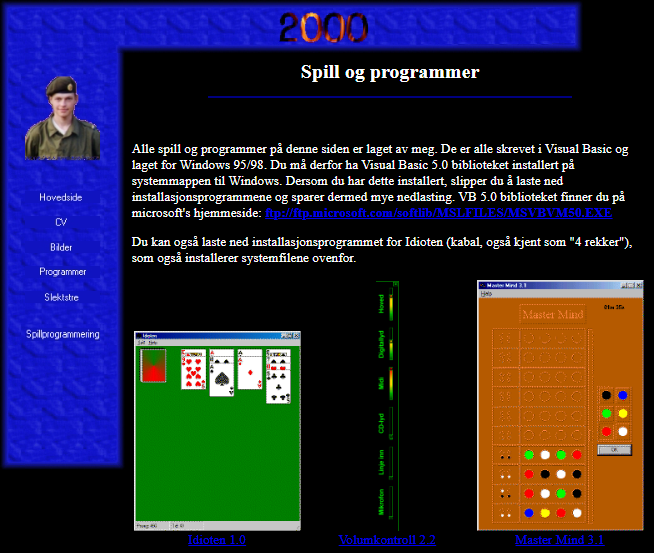
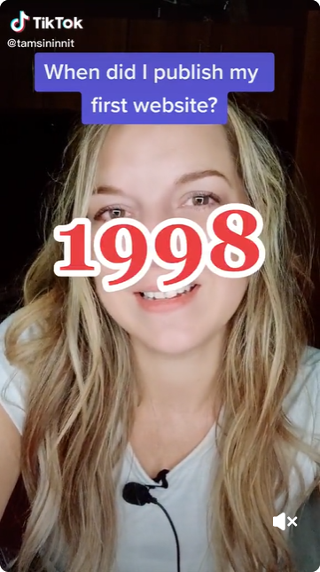

# My personal homepage from 2000

After seeing this TikTok video, I decided to publish my own personal homepages from early days again. I found three of my old homepages on an old backup DVD some years ago, and now they're all on GitHub and hosted for free on Azure Static Websites.

You can see my homepage from 2000 here [https://2000.eivindgl.com](https://2000.eivindgl.com). 
[](https://2000.eivindgl.com)

## TikTok video that inspired me
[](https://www.tiktok.com/@tamsininnit/video/7130172463735934214)
<blockquote class="tiktok-embed" cite="https://www.tiktok.com/@tamsininnit/video/7130172463735934214" data-video-id="7130172463735934214" style="max-width: 605px;min-width: 325px;" > <section>
<a target="_blank" title="@tamsininnit" href="https://www.tiktok.com/@tamsininnit">@tamsininnit</a> <a title="this" target="_blank" href="https://www.tiktok.com/tag/this">#This</a> is my 25th year as a front end web developer 😅 <a title="womenintech" target="_blank" href="https://www.tiktok.com/tag/womenintech">#womenintech</a> <a title="webdev" target="_blank" href="https://www.tiktok.com/tag/webdev">#webdev</a> <a title="millennial" target="_blank" href="https://www.tiktok.com/tag/millennial">#millennial</a> <a title="borninthe80s" target="_blank" href="https://www.tiktok.com/tag/borninthe80s">#borninthe80s</a> <a target="_blank" title="♬ Horror, suspense, weirdness, ghost, UFO - Zassh" href="https://www.tiktok.com/music/Horror-suspense-weirdness-ghost-UFO-6817169438580672514">♬ Horror, suspense, weirdness, ghost, UFO - Zassh</a> </section> </blockquote> 

` `

## 1998 and 2001 homepages
You're going to laugh at the design of the 2000 homepage. 

It looked like I had big plans for a web application to be used as a virtual game room, but I probably didn't have time to learn how to program server side web applications, and I didn't have access to a host provider supporting such things those days.

Actually the 1998 homepage was slightly better, and had more content. The 2001 homepage was way better.

 - [1998 homepage](https://github.com/eloekset/1998-homepage)
 - [2001 homepage](https://github.com/eloekset/2001-homepage)

## Techniques
Although the GitHub languages bar of this repo reports 24,4% JavaScript, this website actually never used JavaScript. Instead two **.class** files exist and some `<applet>` elements are used in the menu. Except for the banner linking to the GitHub repo, which was not there originally, no other changes have been done to the source code.

The HTML code was generated by [Microsoft Frontpage 4.0](https://en.wikipedia.org/wiki/Microsoft_FrontPage), as the index.html file says:

```
<meta name="GENERATOR" content="Microsoft FrontPage 4.0">
<meta name="ProgId" content="FrontPage.Editor.Document">
```

Microsoft Frontpage was a so-called [WYSIWYG](https://en.wikipedia.org/wiki/WYSIWYG) editor (What You See Is What You Get). The idea was that you dind't have to type the HTML code manually, and you didn't even need to know HTML to create webpages, as the editor would generate the HTML code for you.

I assume the applet code was something that came with Microsoft Frontpage, that I didn't write myself. There's no corresponding **.java** file in the backup. Java Applets no longer run in modern browsers, so the menu is totally static now.
```
<applet code="fphover.class" codebase="./" width="140" height="24">
  <param name="color" value="#000080">
  <param name="hovercolor" value="#0000FF">
  <param name="textcolor" value="#FFFFFF">
  <param name="text" value="Hovedside">
  <param name="effect" value="glow">
  <param name="url" valuetype="ref" value="hovedside.htm">
  <param name="target" value="sider">
</applet>
```

The main layout used framesets, which was a great way to separate the page in different elements, to keep the menu as a part separated from all of the acutal pages on the website.

If the browser didn't support frames, you just saw the black text on white background telling you to get a better browser:

```
<frameset framespacing="0" border="0" rows="64,*" frameborder="0">
  <frame name="banner" scrolling="no" noresize target="innhold" src="banner.htm">
  <frameset cols="150,*">
    <frame name="innhold" target="sider" src="meny_2.htm" marginwidth="0" marginheight="0" scrolling="no">
    <frame name="sider" src="hovedside.htm" target="_self">
  </frameset>
  <noframes>
  <body>
  <p>Denne siden bruker rammer, men leseren din st�tter ikke disse.</p>
  </body>
  </noframes>
</frameset>
```

Yes, it was bad, and although the layout of frames supported large screen resolutions, the top banner background image was made 700 pixels wide, so the page didn't look great on other screen resolutions than 800x600. An improvement from the 1998 homepage was moving the menu from a quite high frame at the top, to a quite narrow frame to the left, leaving more screen estate left to the actual content. 

The menu layout was just `<p>` elements on top of a background image. As simple as it gets, except for the applets that we no longer see any effect of.

The main page contains a counter that incremented every time the page was loaded. This was very popular at that time, to get some kind of knowledge about how many visistors have been to the website. Usually you could sit and reolad the page, and the counter would increment for every reload, so it didn't actually tell anything about unique visitors. It looks like the counter used on this website was something provided by Microsoft Frontpage - a **fpcount.exe** file returning the image representing the count:

```
<p>You're visitor number <!--webbot bot="HitCounter" u-custom
i-digits="0" i-image="1" PREVIEW="&lt;strong&gt;[HitCounter]&lt;/strong&gt;"
i-resetvalue="0" startspan --><!--webbot bot="HitCounter" endspan i-checksum="13657" -->
 since Jan 17, 2000</p>
```

Both the **_vti_bin** folder and the **fp** part of the **.exe** file name indicates that it came from Microsoft Frontpage. [Read about VTI](https://en.wikipedia.org/wiki/Vermeer_Technologies).